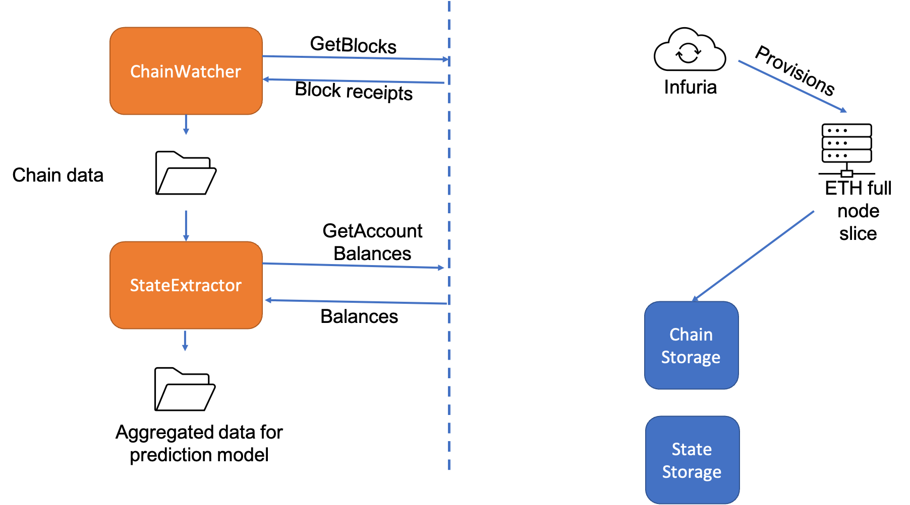
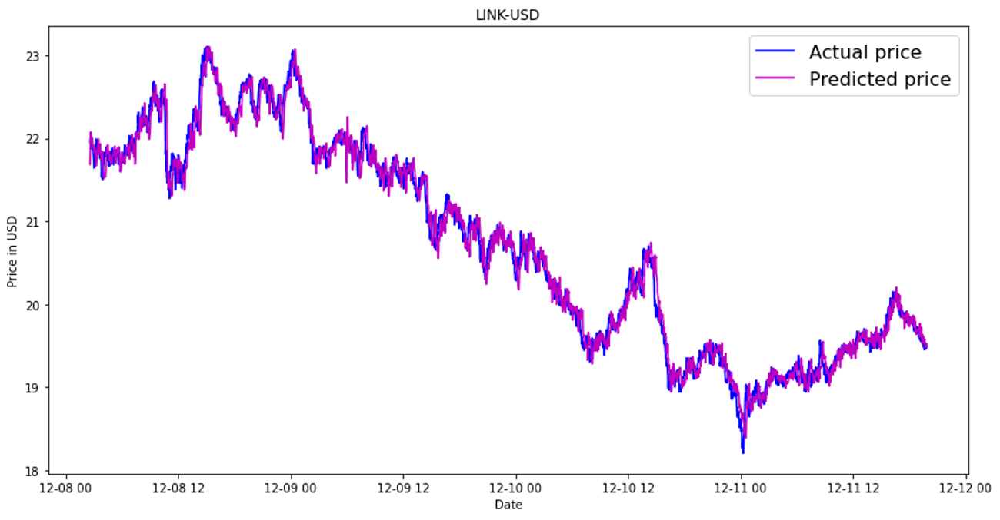
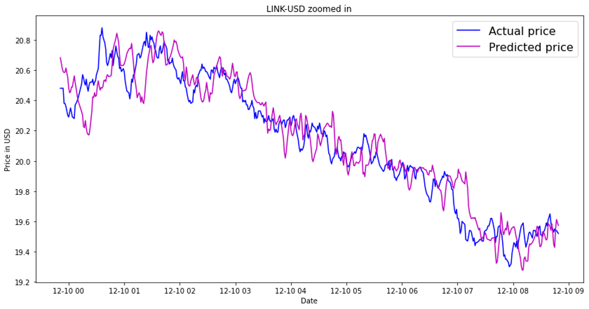
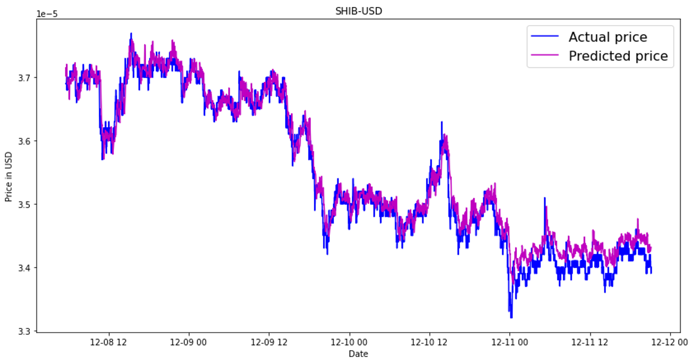

# Group 04 Project Report: Predicting Cryptocurrency Price Fluctuations Using Social, Websearch and Blockchain Media

## Introduction

A model for predicting price movements of cryptocurrencies based on publicity trends on social media and on-chain transaction data. Training data fed into predictive models consists of previous trends and associated cryptocurrency price changes for various coins, and live data of publicity trends for coins serves as test data for models to predict price movements. 2 predictive models - naive bayes for classification and long short-term memory model as a model for granular predictions. We put the proverb “All publicity is good publicity” to test! 

## Social media data collection

We retrieved Reddit data from the subreddit CryptoCurrency using the PushShift API Wrapper package. We only tested one subreddit because of how long the computation time took to retrieve this data due to inadequacies with the Reddit API. We chose the CryptoCurrency subreddit because we think it has a good balance of people posting very reasonable and genuine questions, relevant news articles, and people just stating their opinions. Other cryptocurrency related subreddits had a lot of posts which would just be focused on humor. We used the frequency of posts on the subreddit in an hour span from January 1st to December 20th of 2020 to train the data for the Naive Bayes and the rest of the year to run it on. A potential source of error for this data could be that we checked for search terms involving each coin in the title, sometimes the title might not actually be about said coin. Also no sentiment analysis was done on each post, so whenever it was a negative article it would only affect the prediction in the positive direction. 

We retrieved Google Trends data from the PyTrends package. We used the historical hourly interest from our search terms which is historical, indexed, hourly data for when the keyword was searched most as shown on Google Trends' Interest Over Time section. Each hour is a ratio from the current hour’s number of searches to the highest number of searches over the entire time period searched (one year). This was the only way of retrieving any sort of relevant data which could be a major form of error because we combined multiple search terms’ hourly interest together, which would make the final hourly interest ratio we gathered a ratio of multiple highpoints added up.

## Chain data collection

Transactions of all ERC20 tokens (ERC20 is a token standard on ethereum) are recorded on the ethereum blockchain. 
LINK, SHIB ank MKR are popular ERC20 tokens, hence we collect data on the blockchain for price inference. 
We have implemented a two stage setup to collect transaction and account data from the ethereum blockchain. 
We connect to a full node through the web3 API, our full node provider is a free account on Infuria. 
The two stages are listed as below:

- *Chainwatcher*: This program fetches all transaction data stored in the past x blocks on the ethereum network. 
The main web3 call instantiated by this module is `GetBlocks(Block number)`. This request fetches the block at the height of BlockNumber
on the blockchain. The block consists of all transactions and their corresponding receipts. A receipt in ethereum
corresponds to the details of state changes incurred by the said transactions. From these transactions we filter out transactions
that correspond to the ERC20 token of our choice. Each ERC20 token transfer passes through its contract, hence we filter
out transactions that call the `transfer` method of the corresponding contract. We store the details of the transactions in a json.
This code is implemented at `ethChainData/token-transfer-state.json`
- *StateExtractor*: The state extractor takes the above json file and scans through all transaction participants, it fetches
the balances of all transaction participants by using web3.py API `balanceOf(Account)` request. Thus, we have the following information for each individual transaction:
  - Transaction value
  - Balance of sending party
  - Balance of receiving party

The data is then parsed and stored in a pandas dataframe with data aggregated into time slots. The time slots we use are
`1m` and `1h`. Transaction data is aggregated within a time slot into these 4 signals:
- Mean
- Median
- Max
- Sum

Thus generating a total of 12 data points per time slot.

Note that with the advent of side chains like polygon, many transfer of tokens occur on these sidechains, the same 
code with certain modifications (changing contract address for example) can be used to fetch polygon chain data. 
Our current codebase supports that. The code for ChainWatcher can be found under: `ethChainData/chainWatcher2.py` 
and that for StateExtractor + parser can be found at `ethChainData/jsonParserOptimized.py`. Instructions to run this 
code can be found under `ethChainData/README.md`. We collect data of past 70k ethereum blocks (Nov 30, 2021 to Dec 12, 2021).

## Price data collection

We use Bitmex and Coinbase API to gather price data on the tokens. We use these two exchanges since historical XRP data 
is available on Bitmex and not on Coinbase and historical SHIB data is available on Coinbase and not on Bitmex.

We use the `requests` library to make requests to Coinbase’s API endpoint: `api.pro.coinbase.com`. The requests are made
for a trading pair (Token-USD) within a given time frame, each data point being candle price data for a given time granularity (`1m` or `1h`).
The requests are made as `”https://api.pro.coinbase.com/products/{0}/candles?start={1}&end={2}&granularity={3}”`. The response is parsed
and stored as a pandas dataframe consisting of the following columns: `[timeslot, open, close, high, low, volume]`.

We use Bitmex's python library to make calls to their API endpoint. The library’s `Trade.Trade_getBucketed` method requests the 
bucketed prices of a particular trading pair (Token-USD) within a given time range within a given time granularity (`1m` or `1h`) 
and automatically parses the received response. Each entry in the response consists of `[timeslot, open, close, high, low]`. 
This response is then stored in a pandas dataframe. The code for this implementation can be found at: `priceData/bitmexExplorer2.py`.

For the Naive Bayes classification we fetch price data with a `1h` granularity between Jan 1, 2020 to Dec 31, 2020. 
For LSTM price prediction we fetch price data at a granularity of `1m` from Nov 30, 2021 to Dec 12, 2021. Instructions on how to run 
these programs are provided at `priceData/README.md`.

## Naive Bayes Classifier

We implemented 3 Naive Bayes models: NB classifier (modified multinomial NB), and 2 NB models from the scikit-learn library - CategoricalNB and Gaussian NB. The NB classifier uses laplace smoothing and takes the log of calculated probabilities to prevent underflow. The results from the NB models were less than promising. The results of the NB testing after 8500 data points can be seen in the figure below. Despite the GaussianNB appearing to have the best accuracy, it always predicted a price increase except for the ETH Reddit data. The NB classifier and CategoricalNB made identical predictions, yet were overly bearish as they performed worse than the prediction of always increasing price.

## LSTM predictor

We use neural networks to predict the price of ERC20 tokens using past price data and chain data as input. LSTM (Long Short-Term Memory)
networks are a class of Recurrent neural networks, the de-facto NNs used for analyzing time series data. LSTMs can generalize 
to utilize more historical context of the data by storing and forwarding a context state to future invocations. The code for training 
the LSTM can be found at `LSTM_model/LSTMpredictor.py` and the code for plotting results of the trained networks can be found at `LSTM_model/LSTM_explorer.ipynb`.

We deploy a LSTM with 3 layers, each hidden layer has a dimension of 64. As in input to the LSTM, we provide the past 50 data points. 
The latest past data is (leeway+1) time steps before the current timestep, we set leeway = 10, hence we are predicting prices 11 minutes in advance.
Each past data point consists of 16 dimensions:
- Past open, past close, past high, past low [4]
- Mean, median, max and sum of the transaction transfer values and balances of parties sending and receiving tokens [4*3=12]

We set the optimizer loss as MSE loss and use Adam optimizer at a learning rate of 0.01. The class defining the LSTM network can be 
found under `LSTM_predictor.py` as `LSTM` and the method for loading data is defined as `load_data` under the same file. 
The price and chain data is gathered at a granularity of `1m` for the time ranging from Nov 30, 2021 to Dec 12, 2022. 
67% of the data is used for training and 33% is used for testing. The results of running the predictor on testing data for LINK, SHIB and MKR token are plotted below:

RMSE error for LINK is 0.15. Although the above plot looks very accurate, we can find the flaws in the prediction when 
we zoom into a small time range.

We observe that the plot of predicted price lags the plot of actual price by approximately 10 minutes: the same number as 
the leeway. This implies that the LSTM predictor is giving a lot of weight to the price data in the immediate past and a 
lot less weight to the chain data. We can improve on this by (a) Modifying LSTM architecture, (b) Modifying loss function 
and (c) using training hacks like input randomization. We leave these approaches for future work. Please find the prediction 
results for MKR and SHIB below.

## Conclusion

## Contributions

Ranvir
- Wrote code to fetch and parse Ethereum and Polygon chain data; this code can be found in the `ethChainData` folder
- Wrote code to fetch and parse price data from Coinbase and Bitmex; this code can be found in the `priceData` folder.
- Wrote code to train and test LSTM predictor, this code can be found in the `LSTM_model` folder
- Wrote code to plot results of the LSTM predictor

Ghassan
- Contributed to Google Trends API
- In charge of twitter (tweepy) API that didn’t work out (due to pricing and data limitations)
- Contributed to Reddit API
- Team Leader

Daniel
- Contributed to Google Trends API
- Wrote script for data cleaning
- Contributed to Reddit API
- Researched different twitter APIs to try to find a functional one

Michael
- Wrote library for Naive Bayes training and testing, including the NB clasifier, CategoricalNB, and Gaussian NB; this code can be found in the `NaiveBayes.py` file
- Wrote scirpt for data cleaning (removing duplicate entries to google trend data, and fixing missing entries of price data)
- Wrote code to conjoin social data with price data and train & test each NB model for BTC and ETH based on google trend and reddit data; this code can be found in the `CryptoPredictor.py` file
- Ran analysis of NB results including plotting social data & price correlation, and calculating accuracies of each model with true/false positives/negatives
- Wrote code to launch a scheduler for real-time NB testing with continuous training; this code can be found in the commented out section of the `CryptoPredictor.py` file
- Performed initial project research and based project dea on [this paper](https://www.researchgate.net/publication/279917417_Bitcoin_Spread_Prediction_Using_Social_And_Web_Search_Media)
